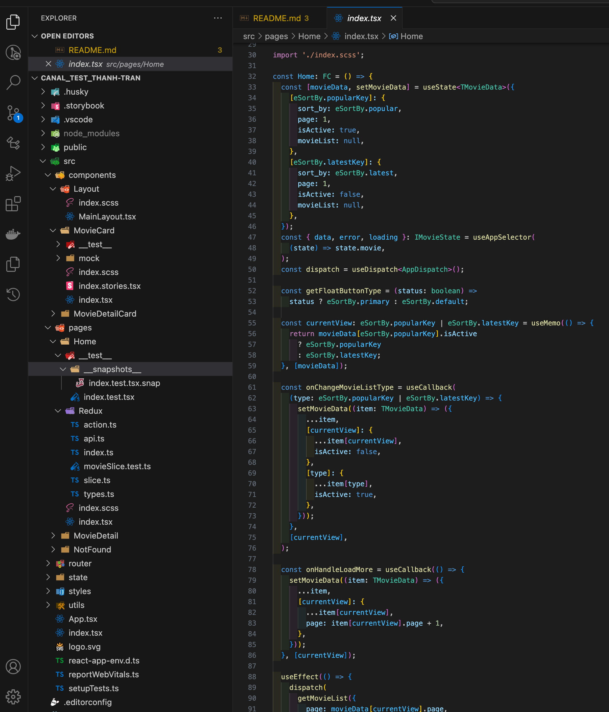
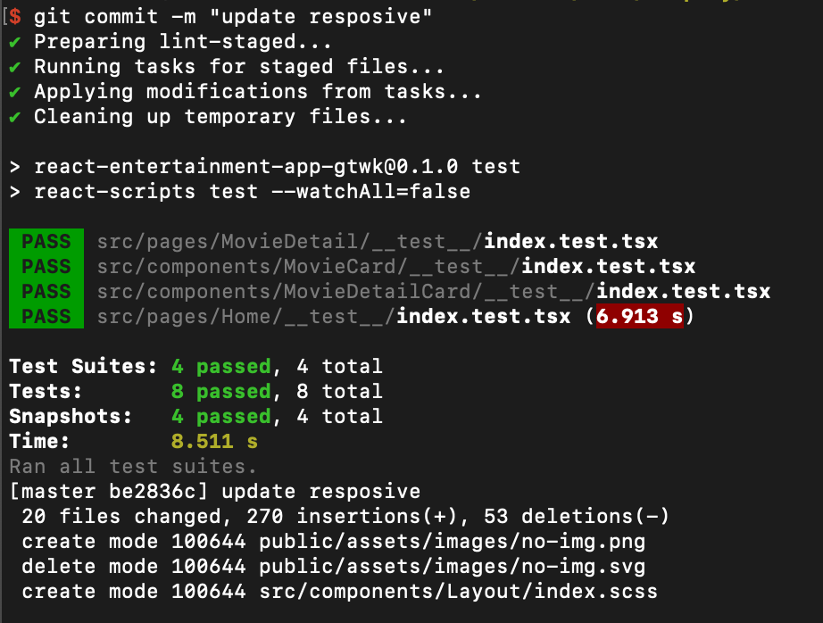
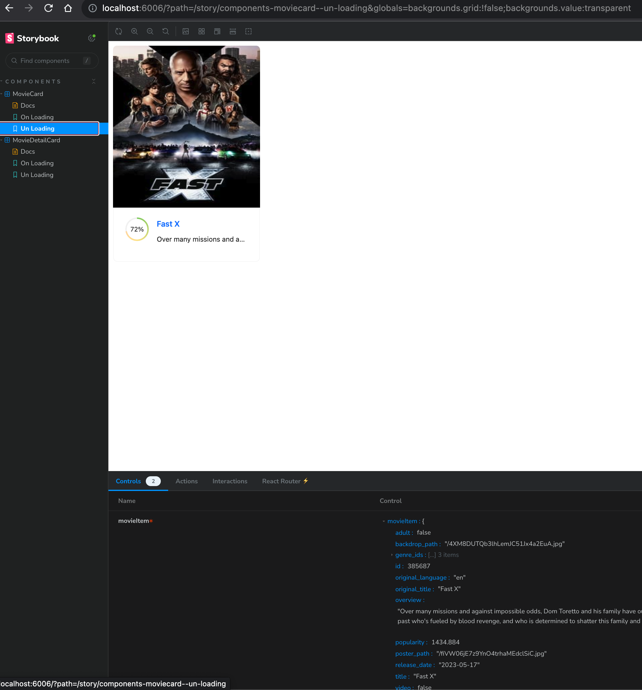
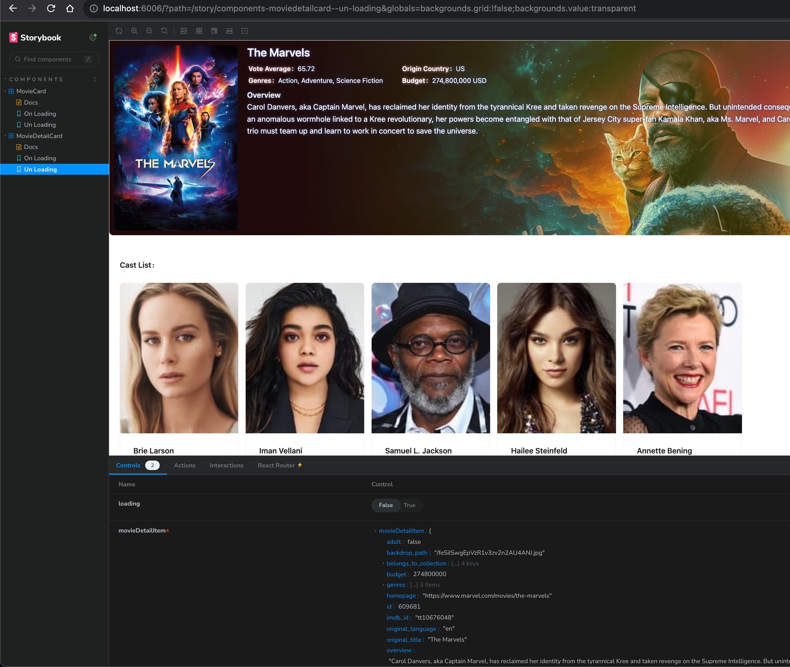

## Description

```bash
An Entertainment Web App
```

Feature handles list

- Stack
  - FE
    - React JS / Ant.Design / TypeScript / Redux Toolkit / Testing Library / Jest / Story Book
  - Convention
    - Eslint / Prettier / Husky
  - State Management
    - Redux / ReduxToolkit
  - Unit Test
    - Testing Library
  - Playground for UI components
    - Storybook
- Page
  - Home
    - Handle UI / Storybook
    - Integration with API
    - Integrating with ReduxToolkit
    - Handle unit testing
    - Handle navigate from home to Movie Detail Page
    - Handle checkout from popular to latest tab and vice versa
    - Handle load more for the latest video list
    - Fix lint and prettier
  - Movie Detail
    - Handle UI / Storybook
    - Integration with API
    - Integrating with ReduxToolkit
    - Handle unit testing
    - Fix lint and prettier

### Node v18.14.0

- Install packages

```bash
npm i
```

- Run the DEV env

```bash
npm run dev
```

- Run the Storybook

```bash
npm run storybook
```

## Video

[Video demo Website and Structure](public/demo/web-and-structure-demo.webm?raw=true)

```bash
public/demo/web-and-structure-demo.webm
```

[Video demo Storybook](public/demo/story-book-demo.webm?raw=true)

```bash
public/demo/story-book-demo.webm
```

## Web App

#### FE Code Structure



#### Git Commit



#### Popular Page


#### Latest Page


#### Detail Page


#### Movie Card Story Book



#### Movie Detail Card Story Book



## Stay in touch

_- Author - Andrew.Tran_
